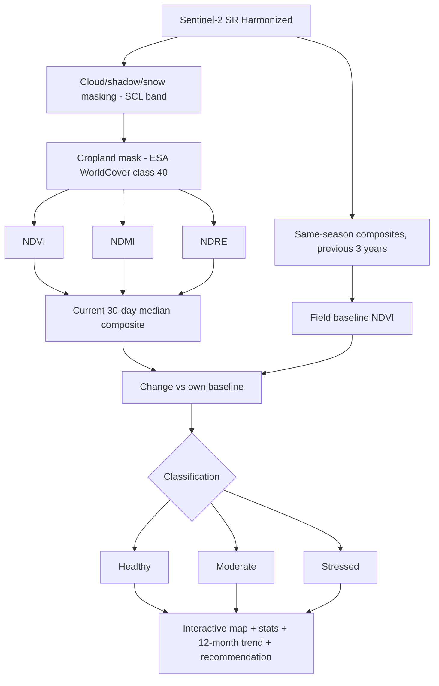

# AgriGuard Architecture

## Classification rules (tunable in `CFG`)
| Class | Condition |
|---|---|
| Stressed | NDVI < 0.35 **or** NDVI drop > 20% vs baseline |
| Moderate | NDVI < 0.55 **or** NDVI drop > 10% vs baseline |
| Healthy | otherwise |

## SDG link
SDG 2 (Zero Hunger), SDG 12 (Responsible Consumption), SDG 13 (Climate Action): early stress detection reduces yield loss and targets water and inputs where needed.
